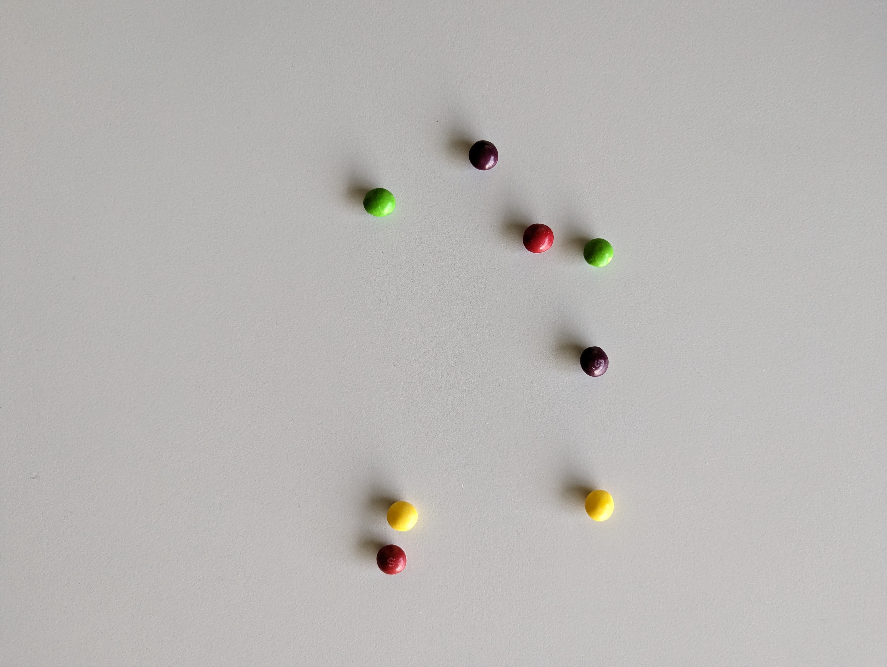

# WdPO_project – Wprowadzenie do Systemów Wizyjnych

Projekt koncentruje się na aplikacji wykorzystującej przetwarzanie obrazu - automatyczna kontrola ilości obiektów na linii produkcyjnej wraz z rozróżnieniem ich klasy np. w celu ich sortowania w dalszym kroku.

Zadanie projektowe polega na przygotowaniu algorytmu wykrywania i zliczania kolorowych cukierków znajdujących się na zdjęciach. Dla uproszczenia zadania w zbiorze danych występują jedynie 4 kolory cukierków:
- czerwony
- żółty
- zielony
- fioletowy

Wszystkie zdjęcia zostały zarejestrowane "z góry", ale z różnej wysokości i pod różnym kątem. Ponadto obrazy różnią się między sobą poziomem oświetlenia oraz oczywiście ilością cukierków.

Poniżej przedstawione zostało przykładowe zdjęcie ze zbioru danych i poprawny wynik detekcji dla niego:

```bash
{
  ...,
  "37.jpg": {
    "red": 2,
    "yellow": 2,
    "green": 2,
    "purple": 2
  },
  ...
}
```

<p align="center">
  
</p>


Katalog [`data`](./data) zawiera przykłady, na podstawie których w pliku [`detect.py`](./detect.py) przygotowany został algorytm zliczania cukierków.

### Wywołanie programu

Skrypt `detect.py` przyjmuje 2 parametry wejściowe:
- `data_path` - ścieżkę do folderu z danymi (zdjęciami)
- `output_file_path` - ścieżkę do pliku z wynikami

W konsoli systemu Linux skrypt można wywołać z katalogu projektu w następujący sposób:

```bash
python3 detect.py -p ./data -o ./results.json
```
